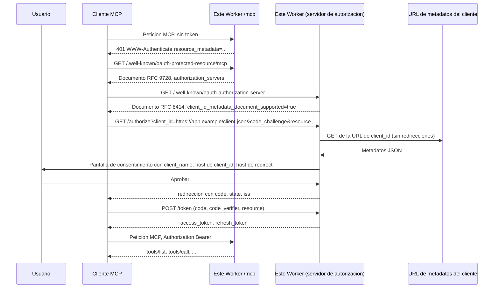

# Servidor MCP de referencia con CIMD

Un servidor remoto de [Model Context Protocol](https://modelcontextprotocol.io) (MCP) que acepta clientes OAuth identificados por un [Client ID Metadata Document](https://datatracker.ietf.org/doc/html/draft-ietf-oauth-client-id-metadata-document-01) (CIMD). Un cliente MCP puede conectarse sin que nadie registre una aplicacion en un portal de desarrolladores.

Autora: [Andrea Griffiths](https://github.com/AndreaGriffiths11). Contribucion de Embajadora AAIF, octubre de 2026. Licencia MIT.

El Worker es a la vez el servidor de recursos MCP (Streamable HTTP en `/mcp`) y su propio servidor de autorizacion OAuth 2.1. Implementa la revision actual de autorizacion de MCP, [2026-07-28](https://modelcontextprotocol.io/specification/2026-07-28/basic/authorization).

Este repositorio es privado hasta que se revise. No cambies su visibilidad, no crees una publicacion (release) y no despliegues una copia publica salvo que la dueña lo pida.

## Que es CIMD y por que MCP lo adopto

MCP 2026-07-28 define tres formas de obtener un `client_id`:

1. Pre-registro, cuando el cliente y el servidor ya tienen relacion.
2. Client ID Metadata Documents, cuando no la tienen (el caso habitual en MCP remoto).
3. Dynamic Client Registration ([RFC 7591](https://datatracker.ietf.org/doc/html/rfc7591)), que la especificacion [depreca](https://modelcontextprotocol.io/specification/2026-07-28/basic/authorization/client-registration#dynamic-client-registration) a favor de CIMD.

Con CIMD el `client_id` es una URL HTTPS. Esa URL es el identificador del cliente y la direccion de un documento JSON que lo describe (`client_name`, `redirect_uris`, etc.). El servidor de autorizacion descarga el documento durante la peticion de autorizacion, comprueba que el `client_id` del JSON coincide con la URL y trata `redirect_uris` como la lista registrada de redirecciones.

DCR pedia a cada servidor de autorizacion un `POST /register` abierto y una fila almacenada por cada cliente desconocido. Eso encaja mal con MCP: un cliente habla con muchos servidores que no conoce, y un servidor ve muchos clientes que no conoce. CIMD deja el documento de registro en el cliente, asi el servidor no mantiene un catalogo de aplicaciones. [McpMetrics](https://x.com/McpMetrics/status/2106479518357635450) conto 2 de 181 servidores MCP oficiales con CIMD el 3 de octubre de 2026. Este repositorio es un ejemplo funcional del lado servidor.

La especificacion MCP sigue citando el borrador CIMD `-00`. Este codigo sigue el borrador [`-01`](https://datatracker.ietf.org/doc/html/draft-ietf-oauth-client-id-metadata-document-01) (2 de marzo de 2026), que conserva las reglas de `-00` y añade que la descarga debe devolver HTTP 200 y que se bloqueen las direcciones IP de uso especial.

## Flujo CIMD



## Inicio rapido

Hace falta Node.js 20.11 o posterior.

```bash
git clone https://github.com/AndreaGriffiths11/cimd-mcp-reference.git
cd cimd-mcp-reference
npm install
```

`.dev.vars` ya esta preparado para uso local: el emisor es `http://localhost:8787` y se aceptan Client ID Metadata Documents en `http://127.0.0.1` y `http://localhost`. Esa excepcion solo aplica cuando el propio emisor es loopback.

Terminal 1:

```bash
npm run dev
```

Wrangler imprime `Ready on http://localhost:8787`. El endpoint MCP es `http://localhost:8787/mcp`.

Terminal 2, inicio de sesion CIMD completo y una llamada a una herramienta:

```bash
node examples/client/cimd-client.mjs
```

El script publica sus metadatos en `http://127.0.0.1:8976/client-metadata.json`, abre el navegador en la pantalla de consentimiento, espera a que pulses Aprobar, canjea el codigo con PKCE y llama a `whoami`, `add_note` y `list_notes`. Añade `--auto-consent` para aprobar desde el script (solo pruebas locales). Añade `--no-browser` para imprimir la URL de autorizacion en lugar de abrirla.

```bash
node examples/client/cimd-client.mjs --auto-consent
```

Debes ver `client_registration: "client-id-metadata-document"` en el resultado de `whoami` y una nota guardada. El cliente no llama a `/register`.

Comprobaciones:

```bash
npm run typecheck
npm test
```

## Que implementa el Worker

Descubrimiento:

- Metadatos de recurso protegido RFC 9728 en `/.well-known/oauth-protected-resource/mcp` y `/.well-known/oauth-protected-resource`.
- `WWW-Authenticate: Bearer ... resource_metadata="..." scope="mcp:tools"` en peticiones a `/mcp` sin token.
- Metadatos de servidor de autorizacion RFC 8414 en `/.well-known/oauth-authorization-server`, con `client_id_metadata_document_supported: true` y `code_challenge_methods_supported: ["S256"]`.
- `authorization_response_iss_parameter_supported: true` y el parametro `iss` en cada redireccion de autorizacion ([RFC 9207](https://datatracker.ietf.org/doc/html/rfc9207)).

CIMD (camino de registro por defecto):

- `client_id` debe ser una URL HTTPS normalizada, con ruta, sin fragmento, sin userinfo y sin segmentos `.` / `..`.
- El documento debe ser HTTP 200, `application/json` o `application/*+json`, de como maximo 5 KiB, con un tiempo de espera de 5 segundos y sin seguir redirecciones.
- El `client_id` del JSON debe ser igual a la URL (comparacion de cadenas). `redirect_uris` es obligatorio; el `redirect_uri` de la peticion debe coincidir exactamente con una entrada.
- SSRF: se rechazan literales IP y nombres no publicos; el DNS se resuelve por HTTPS y cada direccion A/AAAA se contrasta con los rangos de uso especial de RFC 6890 (privadas, loopback, link-local, metadatos, documentacion y el resto de ese registro).
- La pantalla de consentimiento muestra `client_name`, el host de `client_id`, el host de redireccion, los scopes y un aviso si la redireccion es loopback. No se pinta `logo_uri`.

Tokens:

- Solo codigo de autorizacion con PKCE S256 (se rechaza `plain`).
- Los clientes deben enviar el parametro `resource` de RFC 8707, igual al URI canonico MCP de este servidor (`{issuer}/mcp`).
- Los access tokens son cadenas aleatorias opacas, guardadas por hash SHA-256. El endpoint MCP rechaza un token cuya audiencia sea otro recurso.
- Los refresh tokens rotan. Reutilizar uno antiguo revoca toda la concesion.
- Revocacion RFC 7009 en `/revoke`.

Herramientas MCP (con un token valido): `whoami`, `current_time`, `add_note`, `list_notes`. Revision de protocolo 2026-07-28, con atencion sin estado a clientes antiguos que usan `initialize`.

DCR deprecado: desactivado por defecto. Pon `ENABLE_DEPRECATED_DCR=true` en `.dev.vars` (local) o como variable del Worker (desplegado). Los metadatos incluiran entonces `registration_endpoint`. `POST /register` responde `201` con la cabecera `Deprecation: true` y el campo `deprecation_notice`. Los identificadores generados empiezan por `dcr_`, nunca por `https://`. Deja la bandera apagada salvo que compares el camino antiguo.

## Desplegar tu propia copia en Cloudflare

Hace falta una cuenta de Cloudflare y Wrangler con sesion iniciada. Esto no publica el repositorio de GitHub.

1. Pon `ISSUER` en `wrangler.jsonc` al origen HTTPS publico que vas a usar, por ejemplo `https://cimd-mcp-reference.<cuenta>.workers.dev`. Dejalo vacio solo si te vale que el Worker derive el emisor del host de cada peticion.
2. Mantén `DEV_ALLOW_LOOPBACK_CLIENT_IDS` en `"false"` en produccion.
3. Opcional: `CIMD_ALLOWED_HOSTS` con una lista de hosts permitidos para metadatos, separados por comas. Vacio significa cualquier host publico.
4. Opcional: `ALLOWED_ORIGINS` con los origenes de navegador que pueden llamar a `/mcp`.
5. Desde la raiz del repositorio:

```bash
npx wrangler login
npx wrangler deploy
npx wrangler secret put CONSENT_PASSWORD
```

`CONSENT_PASSWORD` es opcional. Si esta definido, la pantalla de consentimiento lo pide antes de emitir un codigo. Usalo si el Worker es alcanzable por mas gente ademas de ti.

El primer despliegue crea el Durable Object `AuthStore` (con SQLite). Los siguientes reutilizan la migracion `v1` de `wrangler.jsonc`.

Tras desplegar, abre `https://<tu-worker>/.well-known/oauth-authorization-server` y confirma que `client_id_metadata_document_supported` es `true`. Apunta un cliente a `https://<tu-worker>/mcp`.

## Conectar desde un cliente

El endpoint MCP es `{issuer}/mcp`. Los clientes descubren el servidor de autorizacion a partir del desafio 401 y de los metadatos de recurso protegido. Deben enviar PKCE S256 y el parametro `resource`.

### El cliente de ejemplo de este repositorio

Comprobado contra `wrangler dev` local el 8 de octubre de 2026: descarga CIMD, consentimiento, codigo+PKCE, token ligado a la audiencia, `whoami` / `add_note` / `list_notes` y rotacion del refresh token.

```bash
node examples/client/cimd-client.mjs --server http://localhost:8787/mcp
```

Contra un Worker desplegado, publica tu propio documento de metadatos en HTTPS (el script puede seguir escuchando el callback en local) y pasa `--client-id https://tu.ejemplo/client.json`. `redirect_uris` del documento debe incluir `http://127.0.0.1:8976/callback` (o el puerto que pases con `--port`).

### MCP Inspector

Inspector 2.x documenta CIMD con `--client-metadata-url` ([autorizacion](https://modelcontextprotocol.io/docs/2026-07-28/tools/inspector/authorization), [flags](https://modelcontextprotocol.io/docs/2026-07-28/tools/inspector/configuration)). El cliente TypeScript de Inspector exige que esa URL use `https` y una ruta distinta de `/`, asi que una URL de metadatos `http://localhost:8787/...` la rechaza Inspector aunque este servidor acepte HTTP loopback en desarrollo.

Contra un Worker HTTPS desplegado:

```bash
npx @modelcontextprotocol/inspector --server-url https://<tu-worker>/mcp --transport http \
  --client-metadata-url https://<tu-worker>/examples/inspector-web.json
```

El Worker sirve ese documento con `client_id` igual a su propia URL y `redirect_uris` igual al valor por defecto de Inspector web, `http://localhost:6274/oauth/callback`. Para CLI o TUI usa `/examples/inspector-cli.json` (`http://127.0.0.1:6276/oauth/callback`).

Contra `wrangler dev` local, publica `examples/cimd/inspector-web.json` (o `inspector-cli.json`) en cualquier URL HTTPS, pon el `client_id` del archivo a esa URL y pasala como `--client-metadata-url`. Un tunel de Cloudflare delante de `wrangler dev` tambien sirve, porque entonces el emisor y `/examples/inspector-web.json` son HTTPS.

### Claude Code, Claude Desktop, Claude.ai

Anthropic documenta CIMD para Claude Code. Una captura independiente del 15 de mayo de 2026 ([Leduccc](https://leduccc.medium.com/testing-cimd-support-across-anthropics-claude-products-585366dbe089)) vio a Claude Code, Claude.ai, Claude Desktop y Claude Cowork enviar `client_id` CIMD en `claude.ai` cuando el servidor de autorizacion anunciaba `client_id_metadata_document_supported: true` y `token_endpoint_auth_methods_supported` con `"none"`. Este servidor anuncia ambas cosas. No repetí esa captura en octubre de 2026.

Los metadatos publicados de Claude Code listan `http://localhost/callback` y `http://127.0.0.1/callback` (sin puerto). En ejecucion redirige a un puerto loopback asignado por el sistema. Este servidor compara `redirect_uri` de forma exacta, como exigen MCP y RFC 9700. RFC 8252 §7.3 pide a los servidores de aplicaciones nativas aceptar cualquier puerto en una redireccion loopback. La coincidencia exacta rechazara por tanto el documento por defecto de Claude Code. Eso es un solapamiento entre especificaciones, no un fallo del cliente que este codigo oculte.

Web, Desktop y Cowork necesitan una URL MCP HTTPS reachable desde fuera (los servidores de Anthropic descargan tus metadatos y llaman a `/mcp`). `wrangler dev` local no basta para esas superficies.

### Otros clientes (Cursor, Windsurf, VS Code)

El mismo texto de mayo de 2026 indico que Cursor y Windsurf usaban DCR cuando se ofrecían CIMD y DCR. Con `ENABLE_DEPRECATED_DCR` apagado, esos clientes fallaran el OAuth salvo que desde entonces hayan añadido CIMD. Confirmalo en el cable: un cliente CIMD envia `client_id=https://...` a `/authorize`; un cliente DCR llama primero a `POST /register`.

## Notas de seguridad

- El trafico de produccion es HTTPS. El HTTP local de Wrangler es para desarrollo.
- Los access tokens van ligados a `{issuer}/mcp`. Un token emitido para otro recurso es un 401.
- Los codigos de autorizacion y los refresh tokens son de un solo uso. Reutilizar un refresh revoca la concesion.
- Las descargas de metadatos no siguen redirecciones, limitan tamaño y tiempo, y rechazan direcciones privadas y de uso especial. Cloudflare Workers tampoco puede abrir conexiones a esas direcciones. El DNS rebinding despues de la comprobacion DoH es un riesgo residual en runtimes que si pueden conectar a la IP resuelta.
- La pantalla de consentimiento es la interfaz de confianza: muestra el host de `client_id` y el de redireccion. Las redirecciones loopback llevan un aviso extra porque CIMD no puede probar que proceso local recibira el codigo.
- Hay un unico dueño de recurso de demostracion (`demo-user`). Define `CONSENT_PASSWORD` si el Worker esta en Internet. Esto es una referencia, no un proveedor de identidad.
- `CIMD_ALLOWED_HOSTS` restringe que dominios pueden alojar metadatos. Usalo si quieres una lista permitida en lugar del modelo CIMD abierto.
- No subas secretos al repositorio. `.dev.vars` de este repo no tiene credenciales. Los secretos de produccion van con `wrangler secret put`.

## Estructura

| Ruta | Papel |
| --- | --- |
| `src/index.ts` | Enrutador del Worker |
| `src/auth/` | CIMD, PKCE, metadatos, consentimiento, token, DCR opcional |
| `src/mcp/` | Endpoint MCP Streamable HTTP y herramientas de demo |
| `src/store/auth-store.ts` | Durable Object: codigos, tokens, cache CIMD, notas |
| `examples/client/cimd-client.mjs` | Cliente de ejemplo |
| `examples/cimd/` | Documentos de metadatos de muestra para Inspector |
| `test/` | Reglas CIMD, SSRF, PKCE, audiencia, flujo del Worker |
| `wrangler.jsonc` | Configuracion del Worker y binding del Durable Object |

## Especificaciones

- [Autorizacion MCP 2026-07-28](https://modelcontextprotocol.io/specification/2026-07-28/basic/authorization)
- [Registro de clientes MCP](https://modelcontextprotocol.io/specification/2026-07-28/basic/authorization/client-registration)
- [Descubrimiento del servidor de autorizacion MCP](https://modelcontextprotocol.io/specification/2026-07-28/basic/authorization/authorization-server-discovery)
- [OAuth Client ID Metadata Document draft-01](https://datatracker.ietf.org/doc/html/draft-ietf-oauth-client-id-metadata-document-01)
- [RFC 8414](https://www.rfc-editor.org/rfc/rfc8414), [RFC 8707](https://www.rfc-editor.org/rfc/rfc8707), [RFC 9207](https://www.rfc-editor.org/rfc/rfc9207), [RFC 9728](https://www.rfc-editor.org/rfc/rfc9728), [RFC 7636](https://www.rfc-editor.org/rfc/rfc7636), [RFC 6890](https://www.rfc-editor.org/rfc/rfc6890)

Ingles: [README.md](README.md).
