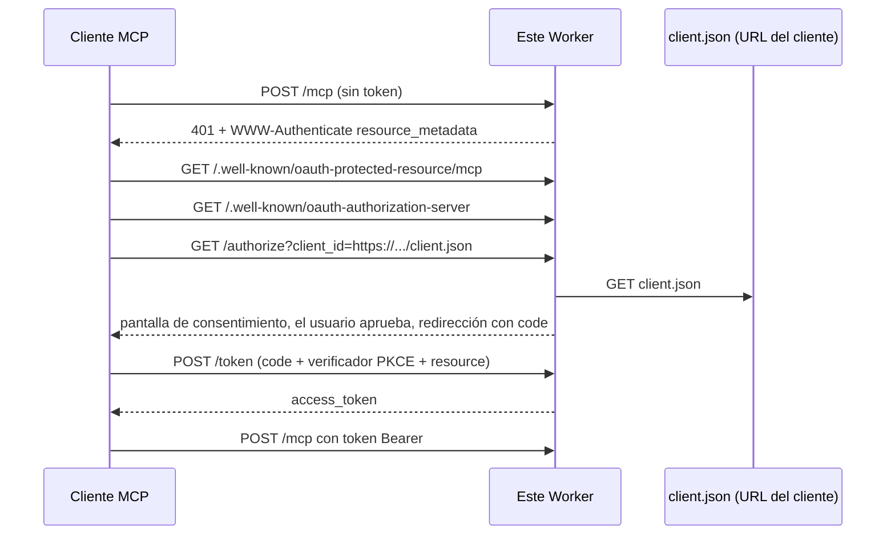

# Servidor MCP de referencia con CIMD

Un servidor MCP remoto en Cloudflare Workers que autentica clientes con OAuth usando un **Client ID Metadata Document (CIMD)** en lugar de registrar la aplicación. Sin portal de desarrolladores, sin `client_secret`, sin `POST /register`.

De [Andrea Griffiths](https://github.com/AndreaGriffiths11). MIT. [English](README.md).

https://github.com/user-attachments/assets/f4a3e5e8-a609-4e93-b560-d16005884880

Página pública (cuando GitHub Pages esté activo): https://andreagriffiths11.github.io/cimd-mcp-reference/?lang=es

Worker en vivo: https://cimd-mcp-reference.andrea-oauth-demos.workers.dev/mcp

Esa URL anuncia `"client_id_metadata_document_supported": true`. La demo alojada no tiene contraseña de consentimiento, de forma intencional. Cualquiera puede autorizar y leer o añadir notas compartidas de demostración. No introduzcas datos privados.

Pruébalo con MCP Inspector (sin servidor local):

```bash
npx @modelcontextprotocol/inspector \
  --server-url https://cimd-mcp-reference.andrea-oauth-demos.workers.dev/mcp \
  --transport http \
  --client-metadata-url https://cimd-mcp-reference.andrea-oauth-demos.workers.dev/examples/inspector-web.json
```

## Pruébalo en local en dos minutos

Requiere Node.js 20.11 o superior.

```bash
git clone https://github.com/AndreaGriffiths11/cimd-mcp-reference.git
cd cimd-mcp-reference
npm install
cp .dev.vars.example .dev.vars
npm run dev                            # terminal 1: servidor en http://localhost:8787
node examples/client/cimd-client.mjs   # terminal 2: login completo + llamada a una herramienta
```

El cliente abre el navegador en una pantalla de consentimiento. En Windows, imprime la URL para que la abras manualmente. Pulsa **Approve**. La terminal muestra `whoami` con `client_registration: "client-id-metadata-document"`, una nota guardada y una renovación de token.

Opciones: `--auto-consent` aprueba sin navegador (solo local), `--no-browser` imprime la URL en lugar de abrirla.

```bash
npm test
npm run typecheck
```

## Qué es CIMD

En OAuth el servidor normalmente tiene que conocer tu aplicación antes de hablar contigo. Los clientes MCP se conectan a servidores que nunca han visto, así que ese modelo no sirve.

CIMD convierte el `client_id` en una **URL HTTPS**. Esa URL aloja un pequeño JSON:

```json
{
  "client_id": "https://app.example.com/client.json",
  "client_name": "Example MCP Client",
  "redirect_uris": ["http://127.0.0.1:3000/callback"],
  "token_endpoint_auth_method": "none"
}
```

El servidor de autorización descarga ese archivo durante el login, comprueba que `client_id` es igual a la URL y usa `redirect_uris` como lista registrada. No se guarda nada del cliente por adelantado.

MCP 2026-07-28 recomienda CIMD y [depreca Dynamic Client Registration](https://modelcontextprotocol.io/specification/2026-07-28/basic/authorization/client-registration#dynamic-client-registration) (RFC 7591). A 3 de octubre de 2026, [2 de 181 servidores MCP oficiales](https://x.com/McpMetrics/status/2106479518357635450) anunciaban CIMD. Este repositorio es un ejemplo funcional del lado servidor.

## El flujo



## Qué implementa

| Área | Detalle |
| --- | --- |
| Descubrimiento | Metadatos de recurso RFC 9728, metadatos de servidor RFC 8414 con `client_id_metadata_document_supported: true`, desafío 401 con `resource_metadata` |
| Identidad del cliente | Solo CIMD por defecto. `client_id` URL HTTPS, coincidencia exacta de `redirect_uri`, límite de 5 KiB, 5 s de espera, sin redirecciones, content type JSON |
| Protección SSRF | Se rechazan IP literales y nombres privados; el DNS se resuelve por HTTPS y cada dirección se contrasta con RFC 6890 |
| Consentimiento | Muestra nombre del cliente, host de `client_id`, host de redirección y scopes; avisa en redirecciones loopback |
| Tokens | Código de autorización + PKCE S256, `resource` RFC 8707, tokens opacos ligados a la audiencia, refresh tokens con rotación, revocación RFC 7009, `iss` RFC 9207 |
| MCP | Streamable HTTP en `/mcp`, protocolo 2026-07-28, herramientas `whoami` `current_time` `add_note` `list_notes` |
| DCR deprecado | `POST /register` existe tras `ENABLE_DEPRECATED_DCR=true`, apagado por defecto, responde con `Deprecation: true` |

Referencia completa de endpoints y configuración: [docs/reference.md](docs/reference.md) (en inglés).

## Despliega el tuyo

```bash
npx wrangler login
npx wrangler deploy
```

Después pon `ISSUER` en `wrangler.jsonc` con tu URL pública (por ejemplo `https://cimd-mcp-reference.<cuenta>.workers.dev`) y despliega de nuevo. Opcional: `npx wrangler secret put CONSENT_PASSWORD` para proteger la pantalla de consentimiento.

Comprobación: abre `https://<tu-worker>/.well-known/oauth-authorization-server` y busca `"client_id_metadata_document_supported": true`.

## Conecta un cliente real

| Cliente | CIMD hoy | Notas |
| --- | --- | --- |
| Cliente de ejemplo de este repo | Sí | Verificado contra `wrangler dev` el 8 oct 2026 |
| MCP Inspector 2.x | Sí | Contra el Worker en vivo: `--client-metadata-url https://cimd-mcp-reference.andrea-oauth-demos.workers.dev/examples/inspector-web.json` |
| Claude Code | Sí | Sus metadatos por defecto usan redirecciones loopback sin puerto; la coincidencia exacta de este servidor las rechaza. Ver [docs/clients.md](docs/clients.md) |
| Claude.ai, Desktop, Cowork | Observado sí (mayo 2026) | Necesita un Worker público HTTPS |
| Cursor, Windsurf | Solo DCR (mayo 2026) | Fallan salvo `ENABLE_DEPRECATED_DCR=true` o que hayan añadido CIMD desde entonces |

Detalles y comandos: [docs/clients.md](docs/clients.md) (en inglés).

## Notas de seguridad

- Los tokens van ligados a `{issuer}/mcp`. Cualquier otra cosa es un 401.
- Códigos y refresh tokens son de un solo uso. Reutilizar un refresh token revoca la concesión.
- Las descargas de metadatos nunca siguen redirecciones, limitan tamaño y tiempo y rechazan direcciones privadas.
- Un único usuario de demostración (`demo-user`), con notas compartidas entre todos los que autorizan. No guardes datos privados en las notas, incluso con `CONSENT_PASSWORD`. Esto es una referencia, no un proveedor de identidad.
- Copia `.dev.vars.example` al archivo ignorado `.dev.vars` para el desarrollo local. Nunca subas secretos; usa `wrangler secret put` en producción.

Más: [docs/security.md](docs/security.md) (en inglés).

## Estructura

```
src/index.ts         enrutador
src/auth/            CIMD, PKCE, metadatos, consentimiento, token, DCR opcional
src/mcp/             endpoint MCP y herramientas de demo
src/store/           Durable Object: códigos, tokens, caché CIMD
examples/client/     cliente de ejemplo
examples/cimd/       documentos de metadatos de muestra para Inspector
test/                CIMD, SSRF, PKCE, audiencia, flujo completo del Worker
docs/                referencia, clientes, seguridad
```

## Especificaciones

[Autorización MCP 2026-07-28](https://modelcontextprotocol.io/specification/2026-07-28/basic/authorization) · [Registro de clientes](https://modelcontextprotocol.io/specification/2026-07-28/basic/authorization/client-registration) · [CIMD draft-01](https://datatracker.ietf.org/doc/html/draft-ietf-oauth-client-id-metadata-document-01) · [RFC 8414](https://www.rfc-editor.org/rfc/rfc8414) · [RFC 8707](https://www.rfc-editor.org/rfc/rfc8707) · [RFC 9207](https://www.rfc-editor.org/rfc/rfc9207) · [RFC 9728](https://www.rfc-editor.org/rfc/rfc9728)
