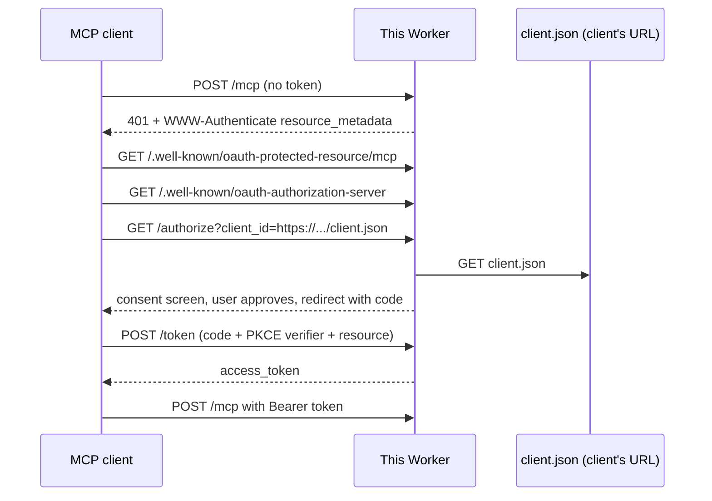

# CIMD MCP reference server

A remote MCP server on Cloudflare Workers that logs clients in with OAuth, using a **Client ID Metadata Document (CIMD)** instead of app registration. No developer portal, no `client_secret`, no `POST /register`.

By [Andrea Griffiths](https://github.com/AndreaGriffiths11). MIT. [Español](README.es.md).

## Try it in two minutes

Requires Node.js 20.11+.

```bash
git clone https://github.com/AndreaGriffiths11/cimd-mcp-reference.git
cd cimd-mcp-reference
npm install
npm run dev                      # terminal 1: server on http://localhost:8787
node examples/client/cimd-client.mjs   # terminal 2: full login + tool call
```

The client opens your browser on a consent screen. Click **Approve**. The terminal then shows `whoami` reporting `client_registration: "client-id-metadata-document"`, a saved note, and a token refresh.

Flags: `--auto-consent` approves without a browser (local only), `--no-browser` prints the URL instead of opening it.

```bash
npm test          # 120 tests
npm run typecheck
```

## What CIMD is

In OAuth the server normally needs to know your app before it will talk to you. MCP clients connect to servers they have never seen, so that model breaks.

CIMD makes the `client_id` an **HTTPS URL**. That URL hosts a small JSON file:

```json
{
  "client_id": "https://app.example.com/client.json",
  "client_name": "Example MCP Client",
  "redirect_uris": ["http://127.0.0.1:3000/callback"],
  "token_endpoint_auth_method": "none"
}
```

The authorization server fetches that file during login, checks `client_id` equals the URL, and uses `redirect_uris` as the registered list. Nothing is stored about the client ahead of time.

MCP 2026-07-28 recommends CIMD and [deprecates Dynamic Client Registration](https://modelcontextprotocol.io/specification/2026-07-28/basic/authorization/client-registration#dynamic-client-registration) (RFC 7591). As of 3 October 2026, [2 of 181 official MCP servers](https://x.com/McpMetrics/status/2106479518357635450) advertised CIMD. This repo is a working server-side example.

## The flow



## What it implements

| Area | Details |
| --- | --- |
| Discovery | RFC 9728 resource metadata, RFC 8414 server metadata with `client_id_metadata_document_supported: true`, 401 challenge with `resource_metadata` |
| Client identity | CIMD only by default. HTTPS URL `client_id`, exact `redirect_uri` match, 5 KiB limit, 5 s timeout, no redirects, JSON content type |
| SSRF guard | IP literals and private names refused; DNS resolved over HTTPS, every address checked against RFC 6890 |
| Consent | Shows client name, `client_id` host, redirect host, scopes; warns on loopback redirects |
| Tokens | Authorization code + PKCE S256, RFC 8707 `resource`, audience-bound opaque tokens, rotating refresh tokens, RFC 7009 revoke, RFC 9207 `iss` |
| MCP | Streamable HTTP at `/mcp`, protocol 2026-07-28, tools `whoami` `current_time` `add_note` `list_notes` |
| Deprecated DCR | `POST /register` exists behind `ENABLE_DEPRECATED_DCR=true`, off by default, answers with `Deprecation: true` |

Full endpoint and config reference: [docs/reference.md](docs/reference.md).

## Deploy your own

```bash
npx wrangler login
npx wrangler deploy
```

Then set `ISSUER` in `wrangler.jsonc` to your public URL (for example `https://cimd-mcp-reference.<account>.workers.dev`) and deploy again. Optional: `npx wrangler secret put CONSENT_PASSWORD` to protect the consent screen.

Check it worked: open `https://<your-worker>/.well-known/oauth-authorization-server` and look for `"client_id_metadata_document_supported": true`.

## Connect a real client

| Client | CIMD today | Notes |
| --- | --- | --- |
| This repo's example client | Yes | Verified against `wrangler dev` on 8 Oct 2026 |
| MCP Inspector 2.x | Yes | `--client-metadata-url https://<your-worker>/examples/inspector-web.json`. The URL must be HTTPS, so use a deployed Worker or a tunnel |
| Claude Code | Yes | Its default metadata uses portless loopback redirects; this server's exact match will reject it. See [docs/clients.md](docs/clients.md) |
| Claude.ai, Desktop, Cowork | Observed yes (May 2026) | Needs a public HTTPS Worker |
| Cursor, Windsurf | DCR only (May 2026) | Fail unless `ENABLE_DEPRECATED_DCR=true` or they have added CIMD since |

Details and commands: [docs/clients.md](docs/clients.md).

## Security notes

- Tokens are bound to `{issuer}/mcp`. Anything else is a 401.
- Codes and refresh tokens are single-use. Replaying a refresh token revokes the grant.
- Metadata fetches never follow redirects, cap size and time, and refuse private addresses.
- One demo user (`demo-user`). Set `CONSENT_PASSWORD` if the Worker is public. This is a reference, not an identity provider.
- No secrets in the repo. `.dev.vars` only enables loopback CIMD for `wrangler dev`.

More: [docs/security.md](docs/security.md).

## Layout

```
src/index.ts         router
src/auth/            CIMD, PKCE, metadata, consent, token, optional DCR
src/mcp/             MCP endpoint and demo tools
src/store/           Durable Object: codes, tokens, CIMD cache
examples/client/     example client
examples/cimd/       sample Inspector metadata documents
test/                CIMD, SSRF, PKCE, audience, full Worker flow
docs/                reference, clients, security
```

## Specs

[MCP authorization 2026-07-28](https://modelcontextprotocol.io/specification/2026-07-28/basic/authorization) · [Client registration](https://modelcontextprotocol.io/specification/2026-07-28/basic/authorization/client-registration) · [CIMD draft-01](https://datatracker.ietf.org/doc/html/draft-ietf-oauth-client-id-metadata-document-01) · [RFC 8414](https://www.rfc-editor.org/rfc/rfc8414) · [RFC 8707](https://www.rfc-editor.org/rfc/rfc8707) · [RFC 9207](https://www.rfc-editor.org/rfc/rfc9207) · [RFC 9728](https://www.rfc-editor.org/rfc/rfc9728)
