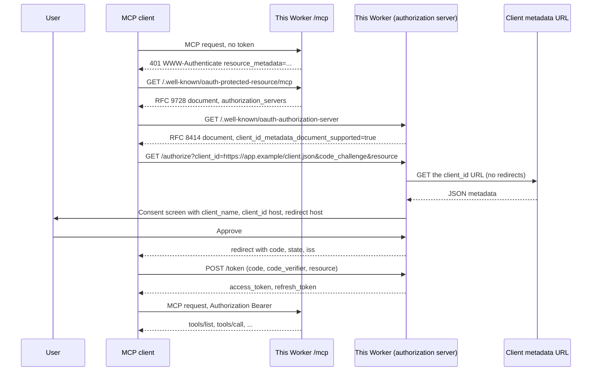

# CIMD MCP reference server

A remote [Model Context Protocol](https://modelcontextprotocol.io) (MCP) server that accepts OAuth clients identified by a [Client ID Metadata Document](https://datatracker.ietf.org/doc/html/draft-ietf-oauth-client-id-metadata-document-01) (CIMD). An MCP client can connect without anyone registering an application in a developer portal.

Author: [Andrea Griffiths](https://github.com/AndreaGriffiths11). AAIF Ambassador contribution, October 2026. MIT licensed.

The Worker is both the MCP resource server (Streamable HTTP at `/mcp`) and its own OAuth 2.1 authorization server. It implements the current MCP authorization revision, [2026-07-28](https://modelcontextprotocol.io/specification/2026-07-28/basic/authorization).

This repository is private until reviewed. Do not change its visibility, create a release, or deploy a public copy unless the owner asks.

## What CIMD is, and why MCP moved to it

MCP 2026-07-28 specifies three ways a client gets a `client_id`:

1. Pre-registration, when the client and server already have a relationship.
2. Client ID Metadata Documents, when they do not (the common case for remote MCP).
3. Dynamic Client Registration ([RFC 7591](https://datatracker.ietf.org/doc/html/rfc7591)), which the spec [deprecates](https://modelcontextprotocol.io/specification/2026-07-28/basic/authorization/client-registration#dynamic-client-registration) in favor of CIMD.

With CIMD the `client_id` is an HTTPS URL. That URL is the client's identifier and the location of a JSON document describing the client (`client_name`, `redirect_uris`, and so on). The authorization server fetches the document during the authorization request, checks that `client_id` in the JSON equals the URL, and treats `redirect_uris` as the registered redirect list.

DCR asked every authorization server to expose an open `POST /register` endpoint and to store a row for every unknown client. That is a poor fit for MCP: a given client talks to many servers it has never seen, and a given server sees many clients it has never seen. CIMD moves the registration document to the client, so the server does not keep a catalog of apps. [McpMetrics](https://x.com/McpMetrics/status/2106479518357635450) counted 2 of 181 official MCP servers advertising CIMD on 3 October 2026. This repo is a working example of the server side.

The MCP spec still cites CIMD draft `-00`. This code follows draft [`-01`](https://datatracker.ietf.org/doc/html/draft-ietf-oauth-client-id-metadata-document-01) (2 March 2026), which is the revision the draft `-00` rules still apply to, plus the `-01` requirements that a metadata fetch must return HTTP 200 and that special-use IP addresses are blocked.

## CIMD flow



## Quick start

Needs Node.js 20.11 or newer.

```bash
git clone https://github.com/AndreaGriffiths11/cimd-mcp-reference.git
cd cimd-mcp-reference
npm install
```

`.dev.vars` is already set for local use: the issuer is `http://localhost:8787`, and `http://127.0.0.1` / `http://localhost` Client ID Metadata Documents are accepted. That exception exists only when the issuer itself is loopback.

Terminal 1:

```bash
npm run dev
```

Wrangler prints `Ready on http://localhost:8787`. The MCP endpoint is `http://localhost:8787/mcp`.

Terminal 2, full CIMD login plus a tool call:

```bash
node examples/client/cimd-client.mjs
```

The script hosts its own metadata at `http://127.0.0.1:8976/client-metadata.json`, opens a browser on the consent screen, waits for you to click Approve, exchanges the code with PKCE, then calls `whoami`, `add_note`, and `list_notes`. Add `--auto-consent` to approve from the script (local testing only). Add `--no-browser` to print the authorization URL instead of opening it.

```bash
node examples/client/cimd-client.mjs --auto-consent
```

You should see `client_registration: "client-id-metadata-document"` in the `whoami` result and a saved note. The client never called `/register`.

Checks:

```bash
npm run typecheck
npm test
```

## What the Worker implements

Discovery:

- RFC 9728 protected resource metadata at `/.well-known/oauth-protected-resource/mcp` and `/.well-known/oauth-protected-resource`.
- `WWW-Authenticate: Bearer ... resource_metadata="..." scope="mcp:tools"` on unauthenticated `/mcp` requests.
- RFC 8414 authorization server metadata at `/.well-known/oauth-authorization-server`, including `client_id_metadata_document_supported: true` and `code_challenge_methods_supported: ["S256"]`.
- `authorization_response_iss_parameter_supported: true` and an `iss` query parameter on every authorization redirect ([RFC 9207](https://datatracker.ietf.org/doc/html/rfc9207)).

CIMD (the default registration path):

- `client_id` must be a normalised HTTPS URL with a path, no fragment, no userinfo, no `.` / `..` segments.
- The document must be HTTP 200, `application/json` or `application/*+json`, at most 5 KiB, fetched with a 5 second timeout and without following redirects.
- `client_id` in the JSON must equal the URL (simple string comparison). `redirect_uris` is required; the request `redirect_uri` must match one entry exactly.
- SSRF: IP literals and non-public names are rejected; DNS is resolved over HTTPS and every A/AAAA address is checked against RFC 6890 special-use ranges (private, loopback, link-local, metadata, documentation, and the rest of that registry).
- The consent page shows `client_name`, the `client_id` hostname, the redirect hostname, the scopes, and a warning when the redirect is loopback. `logo_uri` is not rendered.

Tokens:

- Authorization code + PKCE S256 only (`plain` is refused).
- Clients must send the RFC 8707 `resource` parameter, equal to this server's canonical MCP URI (`{issuer}/mcp`).
- Access tokens are opaque random strings stored by SHA-256 hash. The MCP endpoint refuses a token whose audience is any other resource.
- Refresh tokens rotate. Replaying an old refresh token revokes the whole grant.
- RFC 7009 revocation at `/revoke`.

MCP tools (after a valid token): `whoami`, `current_time`, `add_note`, `list_notes`. Protocol revision 2026-07-28, with stateless serving of older `initialize` clients.

Deprecated DCR: off by default. Set `ENABLE_DEPRECATED_DCR=true` in `.dev.vars` (local) or as a Worker variable (deployed). Metadata then includes `registration_endpoint`. `POST /register` returns `201` with a `Deprecation: true` header and a `deprecation_notice` field. Generated client ids start with `dcr_`, never `https://`. Leave this flag off unless you are comparing the old path.

## Deploy your own copy to Cloudflare

You need a Cloudflare account and Wrangler logged in. This does not publish the GitHub repository.

1. Set `ISSUER` in `wrangler.jsonc` to the public HTTPS origin you will use, for example `https://cimd-mcp-reference.<account>.workers.dev`. Leave it empty only if you are fine with the Worker deriving the issuer from each request's `Origin` host.
2. Keep `DEV_ALLOW_LOOPBACK_CLIENT_IDS` as `"false"` in production.
3. Optionally set `CIMD_ALLOWED_HOSTS` to a comma-separated allow list of metadata hosts. Empty means any public host.
4. Optionally set `ALLOWED_ORIGINS` to the browser origins allowed to call `/mcp`.
5. From the repo root:

```bash
npx wrangler login
npx wrangler deploy
npx wrangler secret put CONSENT_PASSWORD
```

`CONSENT_PASSWORD` is optional. When set, the consent screen requires it before issuing a code. Use it if the Worker is reachable by people other than you.

The first deploy creates the `AuthStore` Durable Object (SQLite-backed). Later deploys reuse the `v1` migration in `wrangler.jsonc`.

After deploy, open `https://<your-worker>/.well-known/oauth-authorization-server` and confirm `client_id_metadata_document_supported` is `true`. Point a client at `https://<your-worker>/mcp`.

## Connect from a client

The MCP endpoint is `{issuer}/mcp`. Clients discover the authorization server from the 401 challenge and the protected resource metadata. They must send PKCE S256 and the `resource` parameter.

### This repository's example client

Verified against local `wrangler dev` on 8 October 2026: CIMD fetch, consent, code+PKCE, audience-bound token, `whoami` / `add_note` / `list_notes`, refresh rotation.

```bash
node examples/client/cimd-client.mjs --server http://localhost:8787/mcp
```

Against a deployed Worker, publish your own HTTPS metadata document (the script can still listen locally for the callback) and pass `--client-id https://your.example/client.json`. The document's `redirect_uris` must include `http://127.0.0.1:8976/callback` (or the port you pass with `--port`).

### MCP Inspector

Inspector 2.x documents CIMD via `--client-metadata-url` ([authorization](https://modelcontextprotocol.io/docs/2026-07-28/tools/inspector/authorization), [flags](https://modelcontextprotocol.io/docs/2026-07-28/tools/inspector/configuration)). The Inspector TypeScript client requires that URL to use `https` and a non-root path, so a raw `http://localhost:8787/...` metadata URL will be rejected by Inspector even though this server accepts loopback HTTP in development.

Against a deployed HTTPS Worker:

```bash
npx @modelcontextprotocol/inspector --server-url https://<your-worker>/mcp --transport http \
  --client-metadata-url https://<your-worker>/examples/inspector-web.json
```

The Worker serves that document with `client_id` equal to its own URL and `redirect_uris` equal to Inspector web's default, `http://localhost:6274/oauth/callback`. For the CLI or TUI, use `/examples/inspector-cli.json` (`http://127.0.0.1:6276/oauth/callback`).

Against local `wrangler dev`, host `examples/cimd/inspector-web.json` (or `inspector-cli.json`) at any HTTPS URL, set the file's `client_id` to that URL, then pass the URL as `--client-metadata-url`. A Cloudflare Tunnel in front of `wrangler dev` also works, because then both the issuer and `/examples/inspector-web.json` are HTTPS.

### Claude Code, Claude Desktop, Claude.ai

Anthropic documents CIMD for Claude Code. An independent capture on 15 May 2026 ([Leduccc](https://leduccc.medium.com/testing-cimd-support-across-anthropics-claude-products-585366dbe089)) saw Claude Code, Claude.ai, Claude Desktop, and Claude Cowork send CIMD `client_id` URLs on `claude.ai` when the authorization server advertised `client_id_metadata_document_supported: true` and `token_endpoint_auth_methods_supported` including `"none"`. This server advertises both. I did not repeat that capture in October 2026.

Claude Code's published metadata lists `http://localhost/callback` and `http://127.0.0.1/callback` (no port). At runtime it redirects to an OS-assigned loopback port. This server matches `redirect_uri` exactly, as MCP and RFC 9700 require. RFC 8252 §7.3 tells native-app authorization servers to accept any port on a loopback redirect. Exact match will therefore reject Claude Code's default document. Treat that as a spec overlap, not as a client bug to paper over silently.

Web, Desktop, and Cowork need a publicly reachable HTTPS MCP URL (Anthropic's servers fetch your metadata and call `/mcp`). Local `wrangler dev` is not enough for those surfaces.

### Other hosts (Cursor, Windsurf, VS Code)

The same May 2026 write-up reported Cursor and Windsurf using DCR when both CIMD and DCR were offered. With `ENABLE_DEPRECATED_DCR` left off, those clients will fail OAuth unless they have since grown CIMD support. Confirm on the wire: a CIMD client sends `client_id=https://...` to `/authorize`; a DCR client calls `POST /register` first.

## Security notes

- Production traffic is HTTPS. Wrangler local HTTP is for development.
- Access tokens are bound to `{issuer}/mcp`. A token minted for another resource is a 401.
- Authorization codes and refresh tokens are single-use. Refresh replay revokes the grant.
- Metadata fetches do not follow redirects, cap size and time, and refuse private and special-use addresses. Cloudflare Workers also cannot open connections to those addresses. DNS rebinding after the DoH check is a residual risk on runtimes that can connect to the resolved IP.
- The consent screen is the trust UI: it shows the `client_id` host and the redirect host. Loopback redirects get an extra warning because CIMD cannot prove which local process will receive the code.
- There is one demo resource owner (`demo-user`). Set `CONSENT_PASSWORD` if the Worker is on the public internet. This is a reference, not an identity provider.
- `CIMD_ALLOWED_HOSTS` restricts which domains may host metadata. Use it if you want an allow list instead of the open CIMD model.
- Do not commit secrets. `.dev.vars` in this repo holds no credentials. Production secrets go through `wrangler secret put`.

## Layout

| Path | Role |
| --- | --- |
| `src/index.ts` | Worker router |
| `src/auth/` | CIMD, PKCE, metadata, consent, token, optional DCR |
| `src/mcp/` | Streamable HTTP MCP endpoint and demo tools |
| `src/store/auth-store.ts` | Durable Object: codes, tokens, CIMD cache, notes |
| `examples/client/cimd-client.mjs` | Example client |
| `examples/cimd/` | Sample Inspector metadata documents |
| `test/` | CIMD rules, SSRF, PKCE, audience, Worker flow |
| `wrangler.jsonc` | Worker config and Durable Object binding |

## Specs

- [MCP authorization 2026-07-28](https://modelcontextprotocol.io/specification/2026-07-28/basic/authorization)
- [MCP client registration](https://modelcontextprotocol.io/specification/2026-07-28/basic/authorization/client-registration)
- [MCP authorization server discovery](https://modelcontextprotocol.io/specification/2026-07-28/basic/authorization/authorization-server-discovery)
- [OAuth Client ID Metadata Document draft-01](https://datatracker.ietf.org/doc/html/draft-ietf-oauth-client-id-metadata-document-01)
- [RFC 8414](https://www.rfc-editor.org/rfc/rfc8414), [RFC 8707](https://www.rfc-editor.org/rfc/rfc8707), [RFC 9207](https://www.rfc-editor.org/rfc/rfc9207), [RFC 9728](https://www.rfc-editor.org/rfc/rfc9728), [RFC 7636](https://www.rfc-editor.org/rfc/rfc7636), [RFC 6890](https://www.rfc-editor.org/rfc/rfc6890)

Spanish: [README.es.md](README.es.md).
